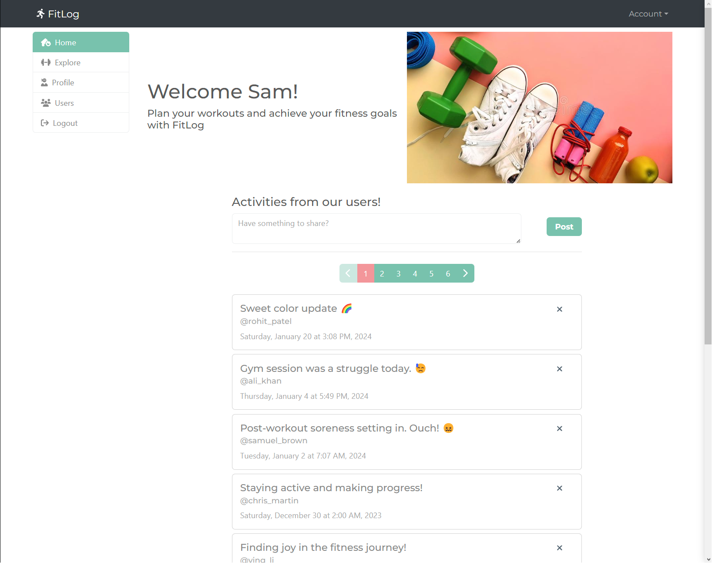
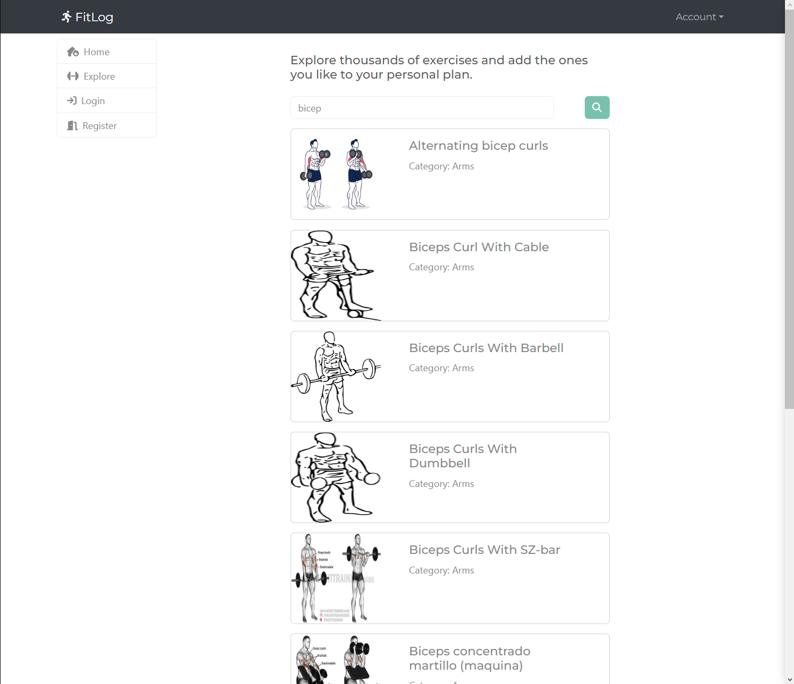
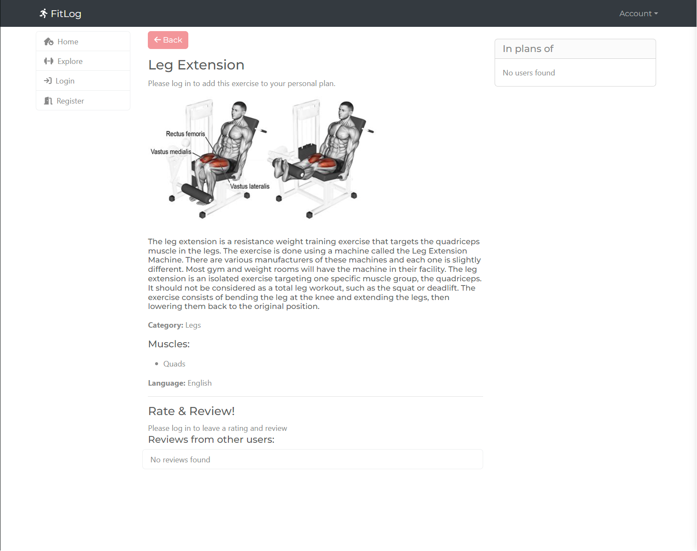
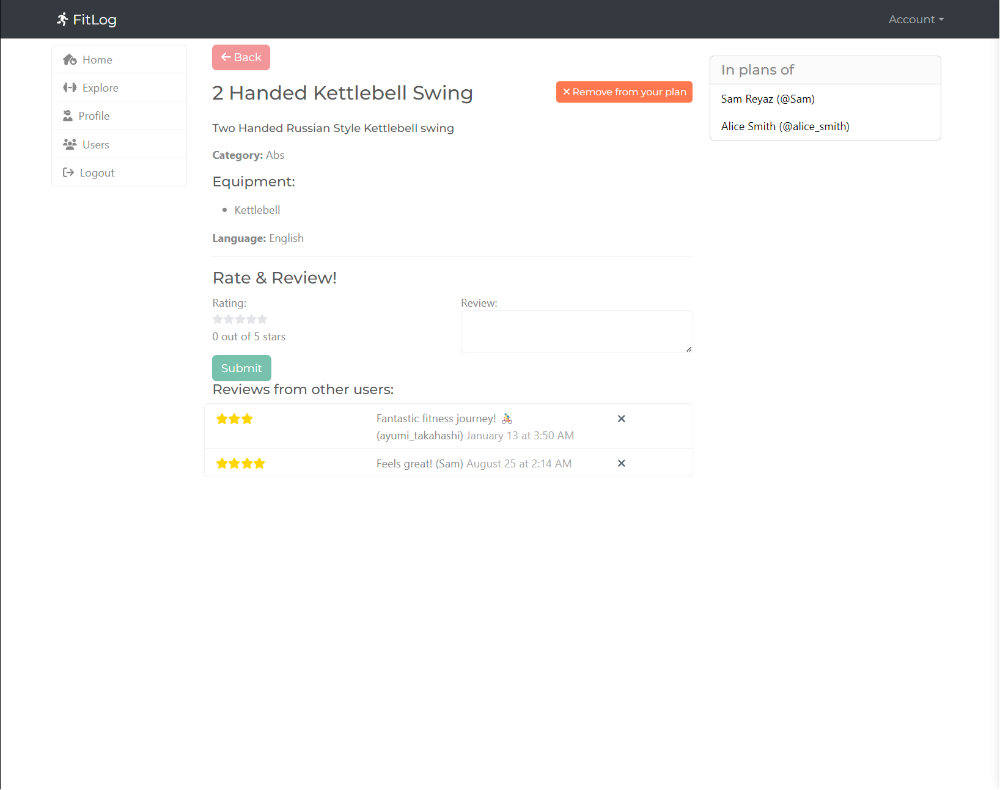
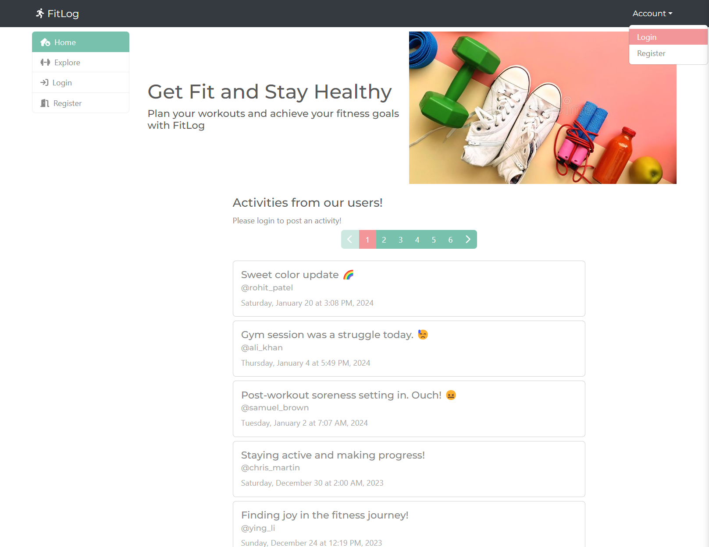
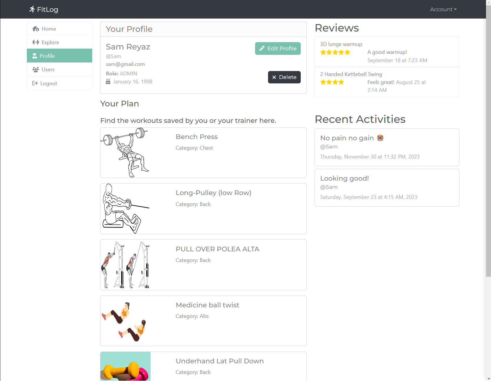
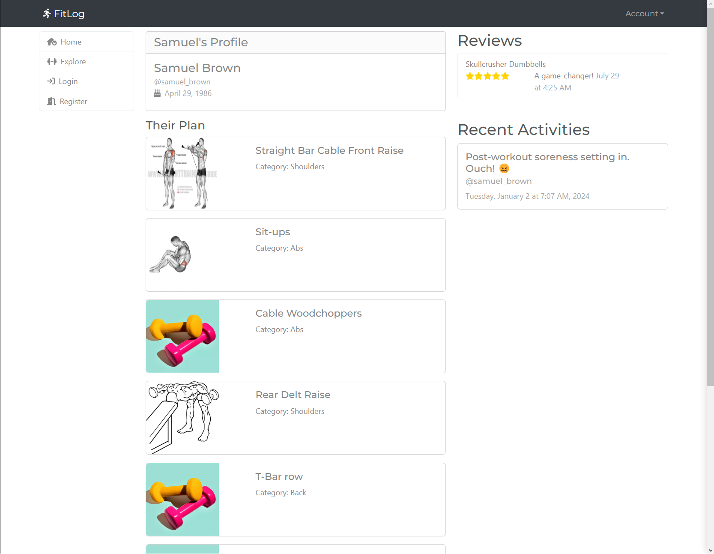
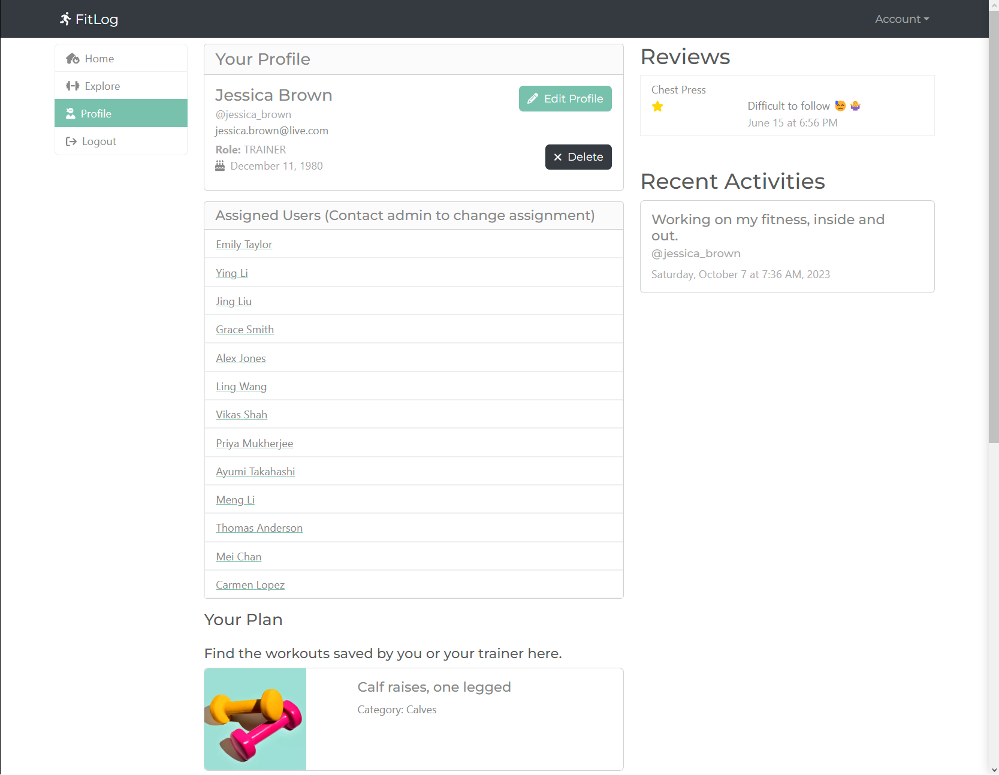

# Fitlog React Web App

#### The frontend for the [website](https://main--sweet-sopapillas-1c3774.netlify.app) with server located [here](https://github.com/SamDaQueen/fitlog-node-server-app).
#### Web application to help fitness trainers & self-trainers find exercises, make fitness plans, rate exercises & interact socially.

---

Created using React.js, Redux, Axios, JavaScript, HTML5, CSS3, Bootstrap. Hosted on Netlify.

> #### **Home page**

> #### **Exercises**

> #### **Exercise details**

> #### **Rating and reviews**

> #### **Logged out**

> #### **Profile**

> #### **Other's profile**

> #### **Trainer profile**

